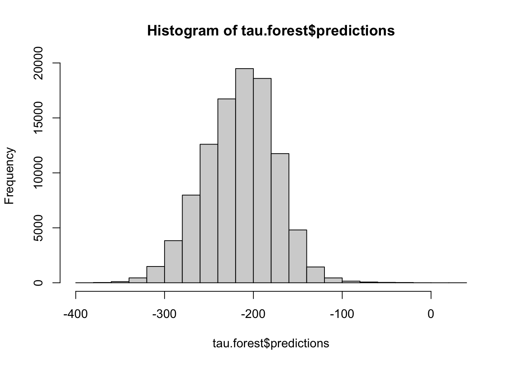

# Maternal Smoking's Impact on Infant Birth Weight:
## A Causal Inference Case Study

This repository presents a case study in applying causal forests, a recently
developed causal inference method, along with the method of sufficient
representation for categorical variables, to estimate the effect of smoking
during pregnancy on infant birth weight. In addition to comparing estimates for
the average treatment effect to those found in the literature, we consider the
average treatment effect on the treated, and attempt to identify treatment
heterogeneity across covariates.

The dataset preparation, training, and analysis code can be found in the
following three Rmarkdown notebooks.

[*Notebook: Dataset preparation*](https://ischeinfeld.github.io/natality/natality_data.html) 
[*Notebook: Training causal forests*](https://ischeinfeld.github.io/natality/natality_train.html) 
[*Notebook: Analysis of average and individual effects*](https://ischeinfeld.github.io/natality/natality_interpret.html)

## Setting

### Smoking during pregnancy and birth weight

Low birthweight is an important risk factor for perinatal morbidity and
mortality, and maternal smoking during pregnancy (SDP) is known to be one of
the most signficant modifiable causes. While the effect of SDP on birth weight
is well known, the chemical and biological linkages are not well understood. 
[[Jaddoe](https://doi.org/10.1111/j.1365-3016.2007.00916.x),
 [Juarez](https://doi.org/10.1371/journal.pone.0061734), 
 [Lumley](https://doi.org/10.1002/14651858.CD001055.pub3),
 [Kataoka](https://doi.org/10.1186/s12884-018-1694-4)]

Estimating the causal effect of SDP on birth weight is complicated by the fact
that both SDP and infant birth weight are potentially impacted by numerous
biological and environmental factors. Most studies attempt to control for
confounding in some way, for example using regression models with a set of
covariates.
[[Jaddoe](https://doi.org/10.1111/j.1365-3016.2007.00916.x),
 [Kataoka](https://doi.org/10.1186/s12884-018-1694-4)]
Jaddoe et al., for example, control for maternal age, height, ethnicity, parity
and infant gender, all of which are known to effect birth weight. 

Other approaches have been used to attempt to estimate the causal effect as
well. For example, Juarez and Merlo conduct both a regression-based analysis
and a quasi-experimental sibling analysis using mother-specific multilevel
linear regression on pairs of births where the mother's SDP status changed.
Their sibling analysis showed a similar but somewhat smaller magnitude effect
compared to their regression analysis, which could indicate that the latter
did not sufficiently control for confounding. 
[[Juarez](https://doi.org/10.1371/journal.pone.0061734)]
While this approach should control for genetic confounders, the assumption that
environmental factors remain fixed for mothers between births is especially
suspect since their change in smoking status could be associated with a
changing environment.

Some randomized experimental studies also provide evidence for SDP's effect on
birth weight, although since SDP itself cannot be randomized these studies
usually randomize interventions intended to prevent SDP.
[[Lumley](https://doi.org/10.1002/14651858.CD001055.pub3)]

### Dataset

[*Notebook: Dataset preparation*](https://ischeinfeld.github.io/natality/natality_data.html)

We use the [Vital Statistics Natality Birth
Data](https://www.nber.org/research/data/vital-statistics-natality-birth-data)
dataset, which provides demographic and health data for births in the United
States. Since 1985, this includes data corresponding to 100% of birth
certificates.

> "Demographic data include variables such as date of birth, age and educational
> attainment of parents, marital status, live-birth order, race, sex, and
> geographic area. Health data include items such as birth weight, gestation,
> prenatal care, attendant at birth, and Apgar score. Geographic data includes
> state, county, [], and metropolitan and nonmetropolitan counties."
> [Vital Statistics Natality Birth Data](https://www.nber.org/research/data/vital-statistics-natality-birth-data)

The breadth of variables available could make controlling for confounding more
reasonable than where less data is available, with the current analysis taking
into account 45 covariates in addition to treatment and outcome. However, it
must be noted that confounders such as genetics would remain uncontrolled for.

A brief discussion of the plausability of the assumptions required by the methods 
applied in this case study is given in the methods section. A full argument is
outside the scope of this case study, and in fact there may be good reasons not
to believe that the necessary assumptions hold. However, the approach is mostly
a technical extension of the regression-based approaches we compare with
insofar as it requires similar assumptions about the data.

### Sample

Following Juarez and Merlo, for our primary analysis we consider the effect on
birth weight of heavy smoking (defined as reporting smoking > 9 cigarettes per
day) compared to not smoking at all. This means we omit light smokers from our
datasets. We also train models for other definitions of treatment.

For computational efficiency, we uniformly sample 100,000 singleton births with
reported cigarettes per day and birth weight. We keep NA values in covariates,
treating them as special values in the subsequent analysis as motivated by an
assumption described below.

## Methods
[*Notebook: Training causal forests*](https://ischeinfeld.github.io/natality/natality_train.html)

### Causal forests

We apply causal forests, as described
[here](https://projecteuclid.org/euclid.aos/1547197251) and as implemented by
the [grf](https://github.com/grf-labs/grf) package. Causal forests are a
non-parametric method for the estimation of heterogenous treatment effects in
observational studies. They require two primary assumptions: unconfoundedness
and overlap.

Unconfoundedness requires that, conditioned on observed covariates, treatment
and potential outcomes are independent. Even with expert knowledge, it can be
difficult to argue for unconfoundedness. Here we will be content to note that
we are controlling for many demographic variables and a large set of variables
arguably picked as medically relevant to childbirth. We acknowledge that we
cannot control for genetics, and as such our results should be interpreted
skeptically. 

Overlap requires that there is a minimum probability that each member of the
population under study is treated and not treated, i.e. that treatment
probabilities (propensities) are uniformly bounded away from 0 and 1. While
this assumption is easier to argue for than unconfoundedness (it seems
plausible that no covariates make smoking during pregnancy impossible or
guaranteed), our model does estimate very low smoking probabilites for some
members of our dataset. This can make estimating treatment effects challenging
for those very unlikely to smoke.

### Missing values

As is the case with many real datasets, the US Natality data contains a
significant number of missing values across many different variables. For this
case study, we choose to assume unconfoundedness despite missignness, i.e. that
missing attributes do to break the unconfoundedness assumption described above.

This is not the only way to handle missing values in causal inference, for a
discussion see this [paper.](https://arxiv.org/abs/1910.10624). Here it is an
expedient choice since tree-based estimators such as causal forests can easily
treat missing values and the proofs for their consistency apply without
modification under unconfoundedness despite missingness.

Whether this assumption is reasonable for our data is a difficult question. Let
us consider, for example, two types of missingness mechanisms we could find in
our dataset. First, assume a covariate is only ommitted when it considered
medically irrelevant. It might be reasonable to assume that the potential
outcomes are independent of its true value conditioned on the recorded value
and whether it is missing. This condition, termed conditional independence of
outcome in the paper above, implies unconfoundedness despite missingness.
Second, consider a covariate which is ommitted due to variation in reporting
practices between hospitals. If this variable was important for controlling
confounding, it may not be reasonable that unconfoundedness holds despite
missingness.

It turns out that a large proportion of missingness in our data can be
explained by regional variations in reporting. This could suggest that an
imputation-based approach might be more suitable. However, where this reporting
difference is systematic it would be impossible to properly impute missing
values, since there would not be any data from which to estimate the
conditional distribution.

### Group variable encoding

Many of the variables in the US Natality data are high-dimensional categorical
variables, for example US state. Causal forests, like many other machine
learning algorithms, require real-valued variable vectors as inputs. While this
is often achieved by using a one-hot encoding, where each category is mapped to
a separate dimension, this can be highly inefficient when the number of
categories is large. In this study, we apply the method of sufficient
representation described in this [paper](), as implemented in the package
[sufrep](https://github.com/grf-labs/sufrep). This approach is suitable where a
categorical variable only effects the estimation target via some unobserved
latent variable. This seems reasonable, for example, in the case of a variable
representing US states, where one could assume that the probability of smoking
and its effects both only depended on state through some state properties such
as demographics, healthcare quality, or smoking laws.

## Results Summary
[*Notebook: Analysis of average and individual effects*](https://ischeinfeld.github.io/natality/natality_interpret.html)

### Average effects

The causal forest gives an average treatment effect (ATE) estimate for heavy
smoking of -193g (std 10.6), compared with -230g given by the naive
difference-in-means estimator. A similar treatment effect considered by Juarez
and Merlo (smoking > 9 cigarettes a day duiring both the first and third
trimester) yielded estimates of the ATE of -303g using a regression analysis
and -226g using a sibling study. Note that their data differs in collection
methods, population (the study took place in Sweden), and the granularity of
treatment (they have separate data for the first and third trimesters).

Since estimated treatment probabilities go very low (<1%) due to the fact that
smoking is quite uncommon during pregnancy, treatment effects for some controls
may not be well identified. For this reason, it can be helpful to look at the
average treatment effect on the treated (ATT). The point estimate of the ATT
here is -214g (std 6.2), which is larger in magnitude than the ATE above, with
a smaller standard error. This would seem to indicate that smoking mothers are
predisposed to more severe effects of smoking on birth weight than mothers who
do not smoke would be if they did.

### Effect heterogeneity

The causal forest calibration is good enough that we can be confident it
is picking up at least some significant heterogeneity in the signal.

The distribution of predicted conditional average treatment effects (CATE)
is concentrated mostly in the (-300g, -100g) range, which seems reasonable
given the expected effect sizes.

Two variables with significant linear associations with the predicted CATE are
parity (number of to-term pregnancies) and mother's age. Groupwise ATE
estimates are as follows. The greater effect of environmental tobacco smoke
on birth weight in older mothers has already been shown. 
[[Ahluwalia](https://doi.org/10.1093/oxfordjournals.aje.a009190)]

| age     | n     | estimate  | std.err  | 
| ------- | ----- | --------- | -------- | 
| [10,21] | 20243 | -155.3205 | 18.30547 |
| (21,25] | 21009 | -155.9506 | 16.90007 |
| (25,29] | 21423 | -178.7270 | 26.40490 |
| (29,33] | 20239 | -242.4721 | 28.97829 |
| (33,54] | 17086 | -247.6665 | 26.47239 |

| parity |  n     | estimate  | std.err  | 
| ------ | ------ | --------- | -------- |
| 1      | 40632  | -187.2538 | 10.77753 |
| 2      | 32612  | -202.6679 | 10.91414 |
| 3      | 16500  | -234.6373 | 13.88215 |
| 4      | 6128   | -258.3118 | 22.62397 |
| 5      | 2151   | -286.6694 | 37.00665 |

Other variables also show significant relationships, for example previous
births over 4000g, eclampsia, and pregnancy-associated hypertension. However,
the counts of births with these risk factors to smoking mothers is so low that
these estimates are not trustworth given the data size. This is reflected in
their group-level ATE estimates having very large standard errors for the
positive case.

## Next Steps

The next logical step in the analysis are to improve variable selection,
primarily to allow for larger training samples (since the forest estimators are
primarily RAM limited on my laptop). This would allow both better ATE and CATE
estimates, as well as more power for the heterogeneity analysis for highly
imbalanced covariates.

## Citations

  
Ahluwalia, I. B., L. Grummer-Strawn, and K. S. Scanlon. “Exposure to Environmental Tobacco Smoke and Birth Outcome: Increased Effects on Pregnant Women Aged 30 Years or Older.” <i>American Journal of Epidemiology</i> 146, no. 1 (July 1, 1997): 42–47. <a href="https://doi.org/10.1093/oxfordjournals.aje.a009190">https://doi.org/10.1093/oxfordjournals.aje.a009190</a>.

  
  
Athey, Susan, Julie Tibshirani, and Stefan Wager. “Generalized Random Forests.” <i>ArXiv:1610.01271 [Econ, Stat]</i>, April 5, 2018. <a href="http://arxiv.org/abs/1610.01271">http://arxiv.org/abs/1610.01271</a>.

  
  
Jaddoe, Vincent W. V., Ernst-Jan W. M. Troe, Albert Hofman, Johan P. Mackenbach, Henriette A. Moll, Eric A. P. Steegers, and Jacqueline C. M. Witteman. “Active and Passive Maternal Smoking during Pregnancy and the Risks of Low Birthweight and Preterm Birth: The Generation R Study.” <i>Paediatric and Perinatal Epidemiology</i> 22, no. 2 (March 2008): 162–71. <a href="https://doi.org/10.1111/j.1365-3016.2007.00916.x">https://doi.org/10.1111/j.1365-3016.2007.00916.x</a>.

  
  
Johannemann, Jonathan, Vitor Hadad, Susan Athey, and Stefan Wager. “Sufficient Representations for Categorical Variables.” <i>ArXiv:1908.09874 [Cs, Stat]</i>, February 15, 2020. <a href="http://arxiv.org/abs/1908.09874">http://arxiv.org/abs/1908.09874</a>.

  
  
Juárez, Sol Pía, and Juan Merlo. “Revisiting the Effect of Maternal Smoking during Pregnancy on Offspring Birthweight: A Quasi-Experimental Sibling Analysis in Sweden.” Edited by Claire Thorne. <i>PLoS ONE</i> 8, no. 4 (April 17, 2013): e61734. <a href="https://doi.org/10.1371/journal.pone.0061734">https://doi.org/10.1371/journal.pone.0061734</a>.

  
  
Kataoka, Mariana Caricati, Ana Paula Pinho Carvalheira, Anna Paula Ferrari, Maíra Barreto Malta, Maria Antonieta de Barros Leite Carvalhaes, and Cristina Maria Garcia de Lima Parada. “Smoking during Pregnancy and Harm Reduction in Birth Weight: A Cross-Sectional Study.” <i>BMC Pregnancy and Childbirth</i> 18, no. 1 (December 2018): 67. <a href="https://doi.org/10.1186/s12884-018-1694-4">https://doi.org/10.1186/s12884-018-1694-4</a>.

  
  
Lumley, Judith, Catherine Chamberlain, Therese Dowswell, Sandy Oliver, Laura Oakley, and Lyndsey Watson. “Interventions for Promoting Smoking Cessation during Pregnancy.” In <i>Cochrane Database of Systematic Reviews</i>, edited by The Cochrane Collaboration, CD001055.pub3. Chichester, UK: John Wiley &amp; Sons, Ltd, 2009. <a href="https://doi.org/10.1002/14651858.CD001055.pub3">https://doi.org/10.1002/14651858.CD001055.pub3</a>.

  
  
Mayer, Imke, Erik Sverdrup, Tobias Gauss, Jean-Denis Moyer, Stefan Wager, and Julie Josse. “Doubly Robust Treatment Effect Estimation with Missing Attributes.” <i>ArXiv:1910.10624 [Stat]</i>, May 22, 2020. <a href="http://arxiv.org/abs/1910.10624">http://arxiv.org/abs/1910.10624</a>.

  
  
National Center for Health Statistics. “Data File Documentations, Natality, 2002.” National Center for Health Statistics, Hyattsville, Maryland., 2002.

  

